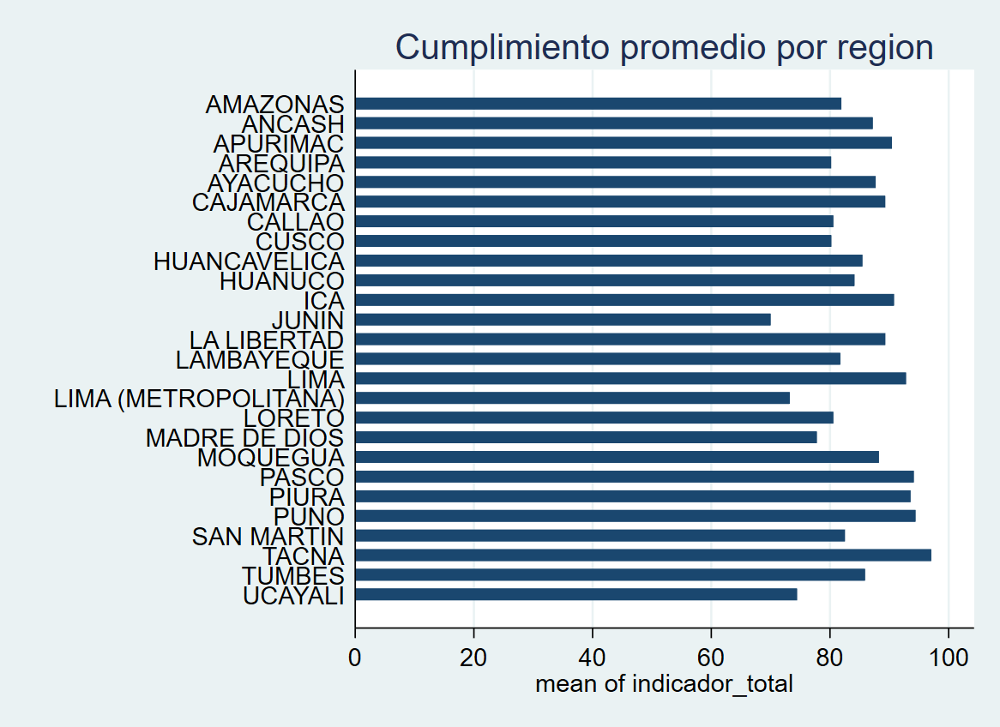
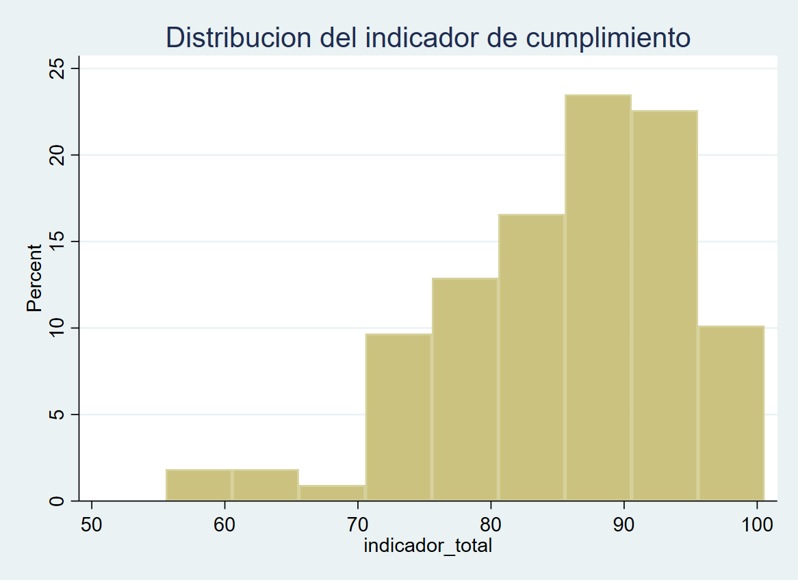

# analisis-indicadores-minedu
Análisis de indicadores de cumplimiento de Unidades Ejecutoras del MINEDU usando Stata.
# 📊 Análisis de Indicadores de Cumplimiento – MINEDU

## 📌 Descripción del proyecto

Este proyecto analiza los **indicadores de cumplimiento de las Unidades Ejecutoras (UE)** del Ministerio de Educación del Perú (MINEDU).

El objetivo es **evaluar el desempeño institucional** utilizando indicadores de cumplimiento y analizar cómo se relaciona con características operativas de las **UGEL (Unidades de Gestión Educativa Local)**.

El análisis se realizó utilizando **Stata**, aplicando técnicas de limpieza de datos, construcción de indicadores y análisis descriptivo.

---

# 🎯 Objetivos del análisis

* Construir un **indicador de cumplimiento institucional**.
* Clasificar las Unidades Ejecutoras según su nivel de cumplimiento.
* Analizar las características de las UGEL según el nivel de cumplimiento.
* Identificar diferencias en recursos administrativos y educativos.

---

# 🗂 Estructura del proyecto

```
analisis-indicadores-minedu
│
├── data
│   └── raw
│       ├── base_ugel.dta
│       ├── cod_ugel.dta
│       ├── cumplimiento.dta
│       └── porcentaje.dta
│
├── scripts
│   └── 01_minedu_analysis.do
│
├── outputs
│   ├── tables
│   └── graphs
│
└── README.md
```

---

# 📂 Datos utilizados

Los datasets utilizados incluyen información sobre:

* Cumplimiento de compromisos de desempeño
* Información administrativa de las UGEL
* Recursos institucionales
* Infraestructura educativa

Principales variables analizadas:

* cumplimiento de compromisos
* personal de UGEL
* computadoras institucionales
* acceso a internet
* infraestructura educativa
* matrícula y docentes

---

# ⚙️ Metodología

El análisis incluye las siguientes etapas:

### 1️⃣ Limpieza y validación de datos

* detección de **missing values**
* verificación de **duplicados**
* revisión de consistencia de variables

### 2️⃣ Construcción del indicador

Se calcula un indicador de cumplimiento basado en:

```
indicador = metas cumplidas / metas totales
```

Este indicador permite medir el desempeño de cada Unidad Ejecutora.

### 3️⃣ Clasificación del desempeño

Las unidades se clasifican en tres niveles:

* **Bajo cumplimiento**
* **Cumplimiento medio**
* **Alto cumplimiento**

### 4️⃣ Análisis descriptivo

Se analizan diferencias entre niveles de cumplimiento en:

* recursos administrativos
* infraestructura educativa
* acceso a tecnología
* distribución regional

---

# 📊 Resultados esperados

El análisis permite identificar:

* diferencias en recursos institucionales entre UGEL
* patrones regionales de cumplimiento
* posibles brechas en infraestructura y tecnología

Estos resultados pueden contribuir al **diagnóstico de capacidades institucionales del sistema educativo**.

---
# 📊 Resultados del análisis

## Cumplimiento promedio por región



Este gráfico muestra el nivel promedio de cumplimiento de las Unidades Ejecutoras según región.

## Distribución del indicador de cumplimiento



El histograma permite observar la distribución del indicador de cumplimiento entre las unidades analizadas.
# 💻 Herramientas utilizadas

* **Stata**
* análisis descriptivo
* manejo de datos administrativos
* construcción de indicadores

---

# ▶️ Cómo ejecutar el proyecto

1. Clonar el repositorio

```
git clone https://github.com/tu_usuario/analisis-indicadores-minedu
```

2. Abrir Stata

3. Ejecutar el script:

```
scripts/01_minedu_analysis.do
```

---

# 👤 Autor

**Renzo Cortez**
Economista | Data Analyst

Intereses:

* análisis de datos
* políticas públicas
* economía aplicada
* analítica para toma de decisiones
* evaluacion de impacto
